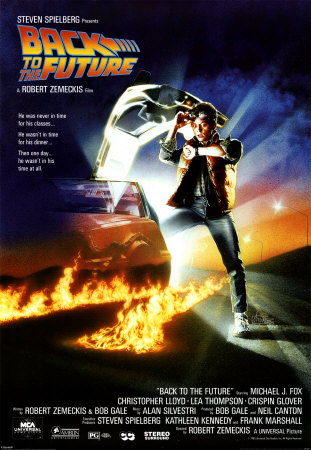

```{r setup, include=FALSE}
options(htmltools.dir.version = FALSE)
knitr::opts_chunk$set(collapse = TRUE,
                      fig.retina = 3)

library(ymlthis)
library(tidyverse)
```

layout: true

---

class: title-slide, center, bottom

# `r rmarkdown::metadata$title`

## `r rmarkdown::metadata$subtitle`

### `r rmarkdown::metadata$author`

---
name: clouds
class: center, middle
background-image: url(images/Clouds.jpg)
background-size: cover

```{r meta, echo=FALSE}
library(metathis)
meta() %>%
  meta_general(
    description = "10 min talk to lab meeting with Dr. Scott Edwards from Harvard University",
    generator = "xaringan and remark.js"
  ) %>% 
  meta_name("github-repo" = "GabrielNakamura/presentation-SEdwardsVisit") %>% 
  meta_social(
    title = "Bridging the gap among community phylogenetics, biogeography and macroevolution",
    url = "",
    image = "",
    image_alt = "The first slide features the presentation tile with a figure centered on the top illustrating an antique world map",
    og_type = "website",
    twitter_card_type = "summary_large_image"
  )
```

???
Thank you everyone for the presence. Im gonna briefly present the work that Ive been developing as a postdoctoral research here at Texas A&M and under the supervision of Dr. Daru

---
template: clouds

## Time travel

???
So to start, this is basically one of the things that must fascinate, the possibility to go back to the past and, based on this, understand what we have in the present days. This inhabits our minds for decades


---

name: clouds
class: center, middle
background-image: url(images/Clouds.jpg)
background-size: cover

## Time travel

.pull-left[
```{r echo=FALSE, out.width="50%", fig.alt= "A a photo with a dog and white flour on the sofa. The dog is with his mouth full of flour"}
 knitr::include_graphics("images/Wonderful_Life_movie.jpeg")
```
]

.pull-right[
```{r echo=FALSE, out.width="50%", fig.alt= "A a photo with a dog and white flour on the sofa. The dog is with his mouth full of flour"}
 
```
]

???
For example, take a look of this picture, and the conclusion is pretty clear. We can understand what happened before just looking at a tiny timeslice

---

## The importance of the past

.pull-left[
```{r echo=FALSE, out.width="50%", fig.alt= "A a photo with a dog and white flour on the sofa. The dog is with his mouth full of flour"}
 
```
]


---
name: clouds
class: center, midle
background-image: url(images/Clouds.jpg)
background-size: cover

## Travelling to the past to understand the present....


```{r echo=FALSE, out.width="50%", fig.alt= "A black and white family album."}
 knitr::include_graphics("images/photo-album.jpeg")
```


???
So, specially from the 90's, the ecological research started to try to get information that can help to understand both current and past processes that influence biodiversity, in other words, instead looking at only present day information the researchers started to find some ways to understand events that occurred in deep past, for example, diversification, historical dispersal.
Therefore, instead of looking at only specific timeslices, we started to look at data Like a family album, so with the information contained in photos from the past we can better understand the context of the most recent events (photographs)


---
name: clouds
class: center, midle
background-image: url(images/Clouds.jpg)
background-size: cover


## The nature's photograph album

```{r echo=FALSE, out.width="70%", fig.alt= "A phylogenetic tree with colors indicating the fish families"}
 knitr::include_graphics("images/phylogeny.png")
```

???
And, which information represent this "family" album to understand the past when we are talking about nature... basically is the phylogenetic information

---

name: clouds
class: center, midle
background-image: url(images/Clouds.jpg)
background-size: cover

## Phylogenetic history + Patterns of distibution of species = More comprehensive view of nature?

???
So, based on this rationale ecological studies started to incorporate the information of evolutionary history into the distribution of present day species, with the desire to better understand the role historical processes in assemblages and regions.

---
template: clouds2
class: middle, center
background-image: url(images/Clouds.jpg)
background-size: cover

## Phylogenies + Data in assemblage scale (local/regional)

.pull-left[
- Assemblages with species with **similar evolutionary history** (clustered) -> effects of **diversification**

- Assemblages with species with **distinct evolutionary history** (overdispersed) -> effects of **dispersal**
]


.pull-right[
```{r echo=FALSE, out.width= "100%", fig.alt="Figure from Crouch et al article showing two phylogenetic trees at the top and the 10 species distributed on two different islands" }

knitr::include_graphics("images/crouch_Ecog.png")

```
]

???

To understand if this evolutionary information coupled with community data can help us understanding large scale patterns lets see this example, this is a figure extracted from an article published in Ecography in 2018 and express the commom rationale used to interpret patterns of diversity in communities. The authors hypothesize that 
if we analyze the phylogenetic patterns in communities we are gonna be able to make some inferences about the importance of speciation versus dispersal events.
The authors basically state...
"greater in situ speciation will create a greater number of shorter branches within a community, where as dispersal will increase the number of long branches in a community as a result of more disparately related species being included"

---
template: clouds2
class: middle, center
background-image: url(images/Clouds.jpg)
background-size: cover

## However... Does the phylogenetic information on assemblages reveal the past?


???
By just looking at the current patterns of phylogenetic distribution, is it really possible
to adequatedly appreciate the role of past events, like in situ speciation and historical dispersal? I.e looking only for the present day patterns, is it possible to understand the past?

---

#### Sometimes, under some assumptions

.center[
.pull-left[
.middle[
- All ancestors of present day species were always in **the same place (or biome/region)**

- The **dispersal is a characteristic that is conserved** along the phylogeny

- The **potential of speciation is always conserved** along the phylogeny

]
]
]

???
If the patterns relative to phylogenetic diversity mentioned above can truly reveal the role of past events those assumptions must be met, resulting in the following pattern.. 


.center[
.pull-right[

```{r echo=FALSE, out.width="90%", fig.alt="A figure showing two phylogenies at the top and two islands at the bottom. Species from phylogeny present a clustered pattern in one island and a overdispersed pattern in another", fig.retina= 3}


```

]
]

???
All ancestors must be present in the same areas of the present day species in case of clustered patterns, and in case of overdispersed communities (island 2), traits associated with dispersion also must be conserved in these communities
In other words, the traits associated with speciation processes must be always!!! conserved
The ancestors of present day species should have been at the same place as the current species. Using a more technical jargon, the area of distribution must be conserved to observe a in situ speciation event, and also, the capacity of dispersal of ancestors.
But.... Is that the way nature works? How can we know where the ancestral was by just looking at the evolutionary relationship among species and their current distribution?
Can other past scenarios produce the same phylogenetic structure we see today?

---

## Different scenarios...

.pull-left[
- **Dispersion** can play an important role

- As well as **in situ diversification**

- Specially if the traits associated with area occupation **are not conserved in phylogeny**

]


.pull-right[
```{r echo=FALSE, out.width="90%", fig.alt= "A phylogenet tree in which species on the tip are conected by lines to two different islands"}
 knitr::include_graphics("images/crouch_broken_premise.png")
```
]

???
Just to simplify lets focus on clustered patterns, that must indicate the importance of speciation. An alternative situation can be the following. Looking at the same islands, with the same communities and the same current distribution of species as the previous Figure, but with the difference that we can see the areas in which the ancestors were in the past, and for island two we can see that even presenting closed related species, the historical dispersal plays an important role in determining present day communities

---
## Different scenarios...

.pull-left[
- **Dispersion** can play an important role

- As well as **in situ diversification**

- Specially if the traits associated with area occupation **are not conserved in phylogeny**

]


.pull-right[
```{r echo=FALSE, out.width="90%", fig.alt= "A phylogenet tree in which species on the tip are conected by lines to two different islands in a slightly different way than the previous figure"}
 knitr::include_graphics("images/crouch_broken_premise2.png")
```
]

???
This is one more example of a different historical process generating the same present day pattern regarding phylogenetic community structure in the same islands.

---
template: clouds2
class: middle, center
background-image: url(images/Clouds.jpg)
background-size: cover

## How to differentiate different processes that can produce similar patterns?

```{r echo=FALSE, out.width="90%", fig.alt= "A phylogenet tree in which species on the tip are conected by lines to two different islands in a slightly different way than the previous figure"}
 knitr::include_graphics("images/diff_scenario_same_metric.png")
```

???
So, how can we differentiate different scenarios with identical patterns? This approach is enoght to understand the role of past events on current distribution of biological diversity? What we are missing? What can we do to unambiguously detect the processes generating patterns of biodiversity?

---
## The importance to look at the deep past


.pull-left[

- The deep past provides a **complementary** vision history

- For example, using **fossils**

- But... fossils are scarce, so we can use **character reconstruction models**

]

???
Based on fossils we could reconstruct some aspects of ecological factors in the past. However, fossils are scarce, making difficult to reconstruct the history of life for a number of species. So, we can rely on methods of character evolution, or character reconstruction, specifically we can rely on methods that are able to estimate the places in which ancestors of present day species were in the past. 

--

.pull-right[

```{r echo=FALSE, out.width="100%", fig.alt= "A photo album with figures of species from the Cambrian period, mixed up with present day invertebrate species and Black and white photos of people"}
 knitr::include_graphics("images/photo_past.png")
```

]

???
With the information from ancestral area reconstruction we can understand better the events looking at different time frames, not just one, like in a photograph album in which we can see photos from both present and the past, instead to assume any premisse. So, basically, the ancestral character reconstruction offer to us the opportunity to travel in time and look at the deep past.

---
name: clouds
class: center, midle
background-image: url(images/Clouds.jpg)
background-size: cover

## How to merge character evoution methods with common metrics used in Community phylogenetics to understand local and large scale patterns?

???
So, the question is, if the metrics of phylogenetic diversity cannot offer a reliable interpretation of past events shaping biological assemblages, how can we consider the evolutionary history acting in different scales, particularly a regional/local scale?

---
template: clouds2
class: middle, center
background-image: url(images/Clouds.jpg)
background-size: cover

## Towards the development of model-based phylogenetic metrics 

???
Basically, one possible way would be merge the information that comes from the ancestral area reconstruction with the metrics of diversity measured in the assemblage scale. So, how does this can be done?

---

## How can we differentiate between historical dispersal and diversification (speciation + extinction)

.pull-left[
- estimating the range of species through **ancestral area reconstruction**

- **decomposing** the amount of evolutionary history that comes from **dispersal events** and from **diversification**
]

???
Basically, the diversity metrics measured at local or regional scales cannot differentiate between processes associated with dispersal and diversification. So, we could first, estimate the range of species through ancestral area reconstruction, and based on this reconstruction we can decompose the evolutionary history of set of species based on the amount of this evolutionary history that emerged from dispersal events, and the amount of evolutionary history that emerged from diversification processes

--

.pull-right[
```{r echo=FALSE, out.width="100%", fig.alt= "A painting illustrating Darwin's finches" }
knitr::include_graphics("images/methods_metrics.png")
```
]

???
Using the same example used before. If we first run a model of ancestral area reconstuction and discover this type of scenario represented in this figure. We will be able to understand that for island 1, despite presenting a clustered phylgoenetic structure, the diversification plays only a small role in shaping this community. With a model based metrics we could be able to see that island 1 present much less influence of diversification processes than island two, even with a clustered pattern.


---

## What does this approach brings as new information

.pull-left[
- More direct and **realistic estimate of evolutionary dynamics** in assemblages

- **Link between patterns and processes** generating biodiversity

- **Unambiguous interpretation** and better decisions regarding **long term conservation actions**
]

???
So, what the advantadges of this proposition when compared with the previous approaches? First, it brings a more realistic estimate of evolutionary dynamics by explicitly incorporate a macroevolutionary model in the calculation of metrics of phylogenetic diversity. Allowing to stablish a direct connection between patterns and the processes responsible for them, and, consequently, providing more confidence in the interpratation of those patterns.

--

.pull-right[
```{r echo=FALSE, out.width="100%", fig.alt= "Maps with metrics of Phylogenetic Endemism and a model based version of the same metric" }
knitr::include_graphics("images/PE_dbPE.png")
```
]

???
For example, just to illustrate the possible use of this approach, in the left side is a spatial representation of how evolutionary unique assemblages of bird species are in the Americas, based on a measure of Phylogenetic Endemism. As any measure avaiable, the original formulation assumes the same premisses discussed before. On the right side we have a version of the same metric of phylogenetic endemism, but now calculated considering how in-situ diversification are responsible to generate patterns of phylgoenetic endemism.  Basically this means that, community with high values of PE model based represent areas with unique spatial information generated exclusively in that biome in which the assemblage are classified.

---

## Differences between traditional approaches and model-based metrics

```{r echo=FALSE, out.width="90%", fig.alt= "A painting illustrating Darwin's finches" }

```

???
Here we can see that looking at just the traditional metrics we can see that we take the risk to underestimate the role of amazon assemblages in maintain through time the phylogenetic endemism for these bird assemblages. Since Amazon corresponds to a region in which the phylgoeentic endemism is almost all genereted through in-situ speciation

---
## Application in regionalization schemes


.pull-left[

Understanding the role of **historical dispersion** and different regions in regionalization schemes

]

.pull-right[
```{r echo=FALSE, out.width="100%", out.height="100%", fig.alt= "a plate with multiple maps showing the proportion of dispersal of each region" }
knitr::include_graphics("images/disp_from.png")
```
]

???
For example, instead of only look at different regions based on a shared evolutionary history we can map the contribution of each region to others, as in this figure. Again, in this scheme we can see how is important the maitenance of amazon assemblages to guarantee the persistence of biodiversity of other regions, since most of the ancestors of present day communities in other regions comes from species originated in amazon.

---
## Application in regionalization schemes

```{r echo=FALSE, out.width="90%", fig.alt= "a plate with multiple maps showing the proportion of dispersal of each region" }
knitr::include_graphics("images/disp_from.png")
```

???
In a closer look we can see how much each biome contributes as a source of species to other biomes, for example, the Amazon biome contribures mainly as a source of species to biomes in the central america 
---
name: clouds
class: center, midle
background-image: url(images/Clouds.jpg)
background-size: cover

## Main contributions


.midle[
- Theoretical perspective: directly assessment of **deep time processes**

- Practical: conservation decision can be based on **both patterns and processes**

]

???
So, finalizing this presentation, basically this approach can contribute in two different perspectives, first, from a theoretical perspective it contributes to directly assess the role of deep time process, instead of inferring them indirectly using present day patterns. In a practical perspective it helps to incorporate important processes required to maintain the biodiversity in long term temporal scales.
