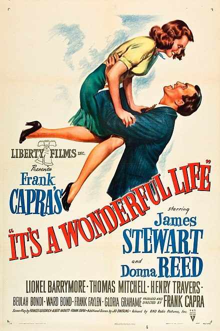

```{r setup, include=FALSE}
options(htmltools.dir.version = FALSE)
knitr::opts_chunk$set(collapse = TRUE,
                      fig.retina = 3)

library(ymlthis)
library(tidyverse)
```

layout: true

---

class: title-slide, center, bottom

# `r rmarkdown::metadata$title`

## `r rmarkdown::metadata$subtitle`

### `r rmarkdown::metadata$author`

---
name: clouds
class: center, middle
background-image: url(images/Clouds.jpg)
background-size: cover

```{r meta, echo=FALSE}
library(metathis)
meta() %>%
  meta_general(
    description = "10 min talk to lab meeting with Dr. Scott Edwards from Harvard University",
    generator = "xaringan and remark.js"
  ) %>% 
  meta_name("github-repo" = "GabrielNakamura/presentation-SEdwardsVisit") %>% 
  meta_social(
    title = "Bridging the gap among community phylogenetics, biogeography and macroevolution",
    url = "",
    image = "",
    image_alt = "The first slide features the presentation tile with a figure centered on the top illustrating an antique world map",
    og_type = "website",
    twitter_card_type = "summary_large_image"
  )
```

???
Thank you everyone for the presence. Im gonna briefly present the work that Ive been developing as a postdoctoral research here at Texas A&M, as Barnabas said Im a postdoc here under his supervision. So, today I will talk a bit about community phylogenetics, macroevolution, biogeography and possible ways to integrate those three different, but very related fields. Before start talk about those exciting topics I would like to talk about another topic that is subject that is apparently far from our field of ecology but are more related than we imagine that is...

---
template: clouds

## Time travel

???
So, time travels are one of the most fascinating ideas and arouse a lot of attention from us.


---

name: clouds
class: center, middle
background-image: url(images/Clouds.jpg)
background-size: cover

## Time travel

.pull-left[
```{r echo=FALSE, out.width="60%", fig.alt= "A a photo with a dog and white flour on the sofa. The dog is with his mouth full of flour"}
 
```
]

.pull-right[
```{r echo=FALSE, out.width="60%", fig.alt= "A a photo with a dog and white flour on the sofa. The dog is with his mouth full of flour"}
 knitr::include_graphics("images/back_to_the_future.jpeg")
```
]

???
It populate our imaginary and is very present in our lives mainly through movies and some fancy speculations that explore this possibility 

---

## The importance of the past

.center[
.pull-left[
```{r echo=FALSE, out.width="60%", fig.cap="Tardis", fig.alt= "A a photo with a dog and white flour on the sofa. The dog is with his mouth full of flour"}
 knitr::include_graphics("images/tardis.png")
```
]
]

.midle[
.pull-right[
- **Curiosity**

- Understanding of **current events based on previous events**

- Predict possible **future scenarios**

]
]

???
But, why we have such fascination about time travel topics? First, of all I believe that is a matter of intrinsically curiosity to discover something that is resembles a fiction history, imagine how incredible would be to travel in time inside the Tardis, the success of Dr. Who series reflect a little bit our fascination


---
## The importance of the past

.center[
.pull-left[
```{r echo=FALSE, out.width="60%", fig.cap="Herodotus, The Father of History", fig.alt= "A a photo with a dog and white flour on the sofa. The dog is with his mouth full of flour"}
 knitr::include_graphics("images/Herodotus.jpeg")
```
]
]

.midle[
.pull-right[
- **Curiosity**

- Understanding of **current events based on previous events**

- Predict possible **future scenarios**

]
]

???
Other reasons are, and much more reliable by the way, are that through the knowledge of past events we can understand better our present reality, and sometimes we can predict with more confidence what will happen in the future..


---
name: clouds
class: center, midle
background-image: url(images/Clouds.jpg)
background-size: cover

## Ecology as a historical science

```{r echo=FALSE, out.width="30%", fig.alt= "A a photo with a dog and white flour on the sofa. The dog is with his mouth full of flour"}
 knitr::include_graphics("images/gould_wonderful_life.jpeg")
```

???
And at this point that history meets Ecological research. Ecology is a historical science, as Gould pointed in his amazing book Wonderful Life.

---
name: clouds
class: center, midle
background-image: url(images/Clouds.jpg)
background-size: cover

## Ecology as a historical science

.pull-left[
```{r echo=FALSE, out.width="60%", fig.alt= "A a photo with a dog and white flour on the sofa. The dog is with his mouth full of flour"}
 knitr::include_graphics("images/gould_wonderful_life.jpeg")
```
]

.pull-right[
- The **Nature of History**

- The **role of history** in shape current patterns of biodiversity

- Fossils as a window to the past
]

???
Historical events matters a lot if we want to understand the current forms and distributions of life on earth
 
---
name: clouds
class: center, midle
background-image: url(images/Clouds.jpg)
background-size: cover

## Ecology as a historical science

.pull-left[
```{r echo=FALSE, out.width="100%", fig.alt= "A a photo with a dog and white flour on the sofa. The dog is with his mouth full of flour"}

knitr::include_graphics("images/pyron_geb.png")

```

```{r echo=FALSE, out.width="100%", fig.alt= "A a photo with a dog and white flour on the sofa. The dog is with his mouth full of flour"}


```
]

.pull-right[
.center[
.middle[

- The importance of **historical events on macroecological patterns**

- **Biogeographical history** of different regions

]
]
]

???
And actually the importance of historical events has been acknowledge, but mainly in a macroecological scale. For example, to understand how speciation and historical dispersal events shape macroecological patterns or regionalization schemes

---
name: clouds
class: center, midle
background-image: url(images/Clouds.jpg)
background-size: cover

## How can understand the effects of deep past shaping biodiversity in ecological communities?

.pull-left[

```{r echo=FALSE, out.width="55%", fig.alt= "A black and white family album."}
 
```

```{r echo=FALSE, out.width="55%", fig.alt= "A black and white family album."}
 knitr::include_graphics("images/article_deep_past.png")
```

]


.pull-right[

- **Phylogenetic structure** of communities as a **proxy to processes** 

- Current patterns present **imprints of deep past**

- Similar patterns indicate effects of same processes

]


???
But, at a more local scale, for example, assemblage scale, how can we understand the effects of deep past events like speciation and dispersal to shape patterns that we see at local scale. One proposed solution to do this is to characterize the phylogenetic structure of communities or assemblages, and, patterns regarding phylogenetic metrics in those local communities will express the imprints of different processes acting on the assembly processes of those communities

---
name: clouds
class: center, midle
background-image: url(images/Clouds.jpg)
background-size: cover

## How can understand the effects of deep past shaping biodiversity in ecological communities?

### same patterns, different stories (processes)

```{r echo=FALSE, out.width="65%", fig.alt= "A black and white family album."}
 knitr::include_graphics("images/diff_scenario_same_metric.png")
```

???
But rely only on current patterns of phylogenetic structure of assemblages does not guarantee that we will able to detect the imprints of those historical processes. This is a classical example of three different scenarios that can produce the same patterns of current phylogenetic structure. If we had a Tardis machine to see where the ancestors of species came from we can see that a different combination of speciation and dispersal can produce the same pattern

---
name: clouds
class: center, midle
background-image: url(images/Clouds.jpg)
background-size: cover

## How can understand the effects of deep past shaping biodiversity in ecological communities?

```{r echo=FALSE, out.width="70%", fig.alt= "A black and white family album."}
 knitr::include_graphics("images/mouquet_biolrev.png")
```

.center[
*"...the **interplay between evolutionary and ecological processes** at different temporal and spatial scales that may **generate similar hypotheses regarding phylogenetic structures**"*
]

---
name: clouds
class: center, midle
background-image: url(images/Clouds.jpg)
background-size: cover

## How can understand the effects of deep past shaping biodiversity in ecological communities?

<div class="flex" style="margin: 0 1em;">
  <div class="column">
    <h3> Theoretical Framework </h3>
    
  </div>

---
name: clouds
class: center, midle
background-image: url(images/Clouds.jpg)
background-size: cover

## How can understand the effects of deep past shaping biodiversity in ecological communities?

<div class="flex" style="margin: 0 1em;">
  <div class="column">
    <h3> Theoretical Framework </h3>
    
  </div>

<div class="flex" style="margin: 0 1em;">
  <div class="column">
    <h3> Numerical tools </h3>
    
  </div>  
---
name: clouds
class: center, midle
background-image: url(images/Clouds.jpg)
background-size: cover

## How can understand the effects of deep past shaping biodiversity in ecological communities?

<div class="flex" style="margin: 0 1em;">
  <div class="column">
    <h3> Theoretical Framework </h3>
    
  </div>

<div class="flex" style="margin: 0 1em;">
  <div class="column">
    <h3> Numerical tools </h3>
    
  </div>

<div class="flex" style="margin: 0 1em;">
  <div class="column">
    <h3> Applications </h3>
    
  </div>


---
name: clouds
class: center, midle
background-image: url(images/Clouds.jpg)
background-size: cover

## How can we understand the effects of deep past shaping biodiversity in ecological communities?

### Theory: Towards a integrative framework - A theoretical perspective

occurrence in assemblage scale + macroevolutionary models + macroecological patterns

```{r echo=FALSE, out.width="65%", fig.alt= "A black and white family album."}
 knitr::include_graphics("images/integration.png")
```

---
name: clouds
class: center, midle
background-image: url(images/Clouds.jpg)
background-size: cover

## How can we understand the effects of deep past shaping biodiversity in ecological communities?

### Tools: development of model-based phylogenetic metrics


.pull-left[

- How can we differentiate between historical dispersal and diversification (speciation + extinction)?

- estimating the range of species through **ancestral area reconstruction**

- **decomposing**  evolutionary history that comes from **dispersal events** and from **diversification**
]

???
Basically, the diversity metrics measured at local or regional scales cannot differentiate between processes associated with dispersal and diversification. So, we could first, estimate the range of species through ancestral area reconstruction, and based on this reconstruction we can decompose the evolutionary history of set of species based on the amount of this evolutionary history that emerged from dispersal events, and the amount of evolutionary history that emerged from diversification processes

--

.pull-right[
```{r echo=FALSE, out.width="100%", fig.alt= "A painting illustrating Darwin's finches" }
knitr::include_graphics("images/methods_metrics.png")
```
]


???
So, the question is, if the metrics of phylogenetic diversity cannot offer a reliable interpretation of past events shaping biological assemblages, how can we consider the evolutionary history acting in different scales, particularly a regional/local scale?


---
name: clouds
class: center, midle
background-image: url(images/Clouds.jpg)
background-size: cover

## Tools: linking patterns with processes

### Understanding the role of diversification x historical dispersal in shapping assemblages

```{r echo=FALSE, out.width="70%", fig.alt= "A painting illustrating Darwin's finches" }
knitr::include_graphics("images/Jetz_age_arrival.png")
```

???
Here we can see that looking at just the traditional metrics we can see that we take the risk to underestimate the role of amazon assemblages in maintain through time the phylogenetic endemism for these bird assemblages. Since Amazon corresponds to a region in which the phylgoeentic endemism is almost all genereted through in-situ speciation

---
name: clouds
class: center, midle
background-image: url(images/Clouds.jpg)
background-size: cover


## Tools: linking patterns with processes

### Identification of sources of biodiversity

```{r echo=FALSE, out.width="70%", fig.alt= "a plate with multiple maps showing the proportion of dispersal of each region" }
knitr::include_graphics("images/disp_from.png")
```

???
In a closer look we can see how much each biome contributes as a source of species to other biomes, for example, the Amazon biome contribures mainly as a source of species to biomes in the central america 

---
name: clouds
class: center, midle
background-image: url(images/Clouds.jpg)
background-size: cover

## Application: Conservation decision that recognize both present day patterns and process

```{r echo=FALSE, out.width="85%", fig.alt= "A painting illustrating Darwin's finches" }
knitr::include_graphics("images/highlight_PE_amazon.png")
```

